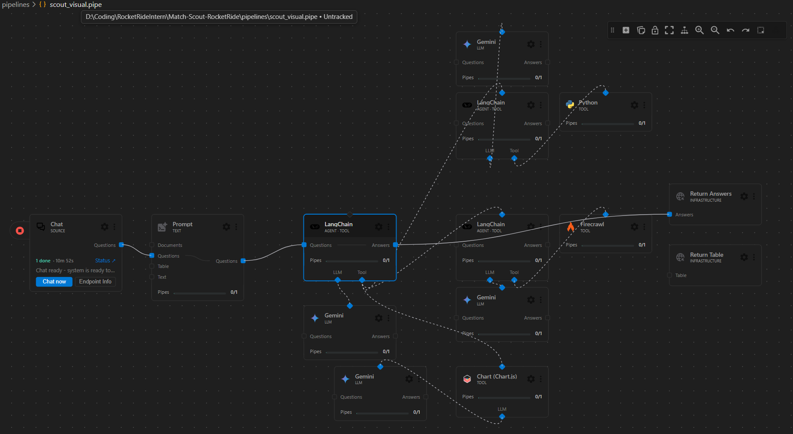
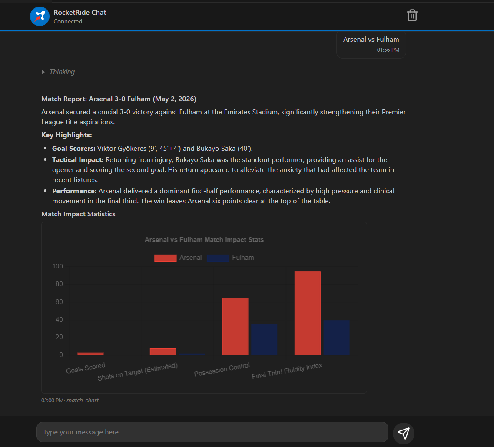
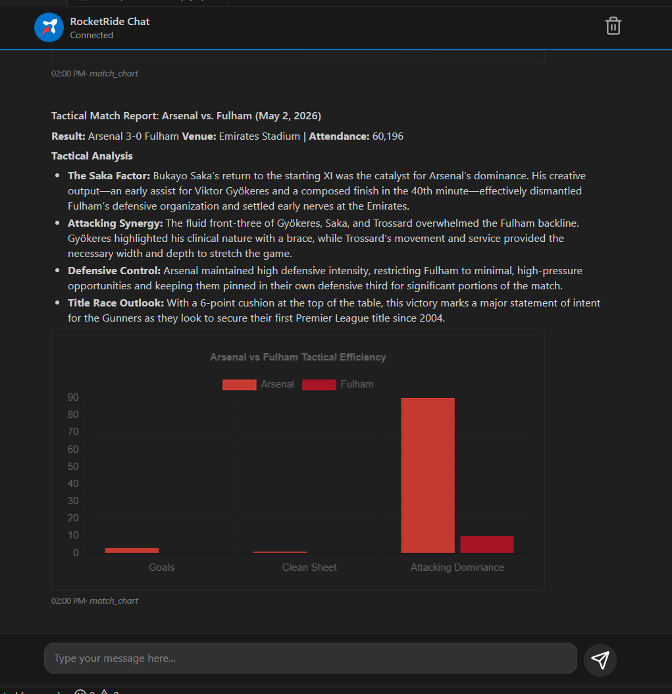

# Agentic Match-Scout: Tactical Match Analysis (RocketRide)

## Overview
**Match-Scout** is a state-of-the-art tactical scouting platform powered by RocketRide and Google Gemini. It automates the process of identifying match reports, extracting deep tactical data, and generating professional scouting briefings with dynamic visualizations.

The platform is designed for soccer analysts and coaches who need on-demand, data-driven insights into English soccer matches.

## The Intention
The core intention of this project is to bridge the gap between raw web data and actionable tactical intelligence. By leveraging a hierarchical agent architecture, we ensure that:
- **Discovery** is precise (finding the exact match report).
- **Extraction** is comprehensive (scraping deep stats and tactical observations).
- **Visualization** is immediate (generating charts to summarize the data).

## Hierarchical Pipeline Architecture
The system operates using a "Master-Slave" agent hierarchy, ensuring specialized focus at every stage of the workflow.

### Core Nodes:
1.  **Master Scout (Orchestrator)**: The central brain of the pipeline. It receives the user query and manages the lifecycle of the scouting task by delegating to specialized tools and sub-agents.
2.  **Search Specialist (Agent Tool)**: A dedicated agent that uses the **Python Tool** (Firecrawl SDK) to perform semantic searches across sports news domains to find the most relevant match report URL.
3.  **Scrape Specialist (Agent Tool)**: A focused agent that uses the native **Firecrawl Tool** node to ingest and clean the content of the identified URL.
4.  **Chart Generator (Visual Tool)**: A specialized utility powered by **Chart.js** and LLM reasoning that transforms the extracted stats into beautiful, interactive radar and bar charts.

## Visualization & UI
The end result is a premium, data-rich report delivered directly to the user's dashboard.

### Key Features:
- **Automated Discovery**: No need to provide URLs; simply name the match.
- **Multi-Agent Reasoning**: Complex tactical analysis handled by specialized LLM instances.
- **Dynamic Charts**: Real-time visualization of xG, possession, and player performance.
- **Hierarchical Reliability**: Modular design reduces "hallucinations" and improves extraction accuracy.

## Technical Stack
- **Framework**: [RocketRide](https://rocketride.ai)
- **Intelligence**: Google Gemini 3.1 Flash
- **Search & Scrape**: Firecrawl SDK & Node
- **Logic**: LangChain (via agent_langchain node)
- **Visualization**: Chart.js
